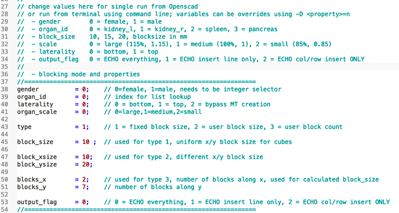

# Millitome Generator V11

Implemented in OpenScad 2021.1. Developed on MacOS 12.4. Terminal procedures and commands are Mac-specific.
Proper installation requires these items in the same directory location: 
<em>organs</em> (folder) 
<em>MT-Generator.scad</em> (program code to run in Openscad) 
<em>mt_export.bash</em> (bash shell script)

# Folder Contents

<h4>images</h4>
This folder contains images used for documentation. Not required for proper operation of <em>MT-Generator</em>.

<h4>organs</h4>
Contains 24 files in STL format, used by <em>MT-Generator</em> to cut the correct mold shapes. This folder must reside in the same directory from which <em>MT-Generator.scad </em> is launched.  

There are three STL files for each organ:

Edited, simplified geometry of left female kidney: 
<em>f_0_kidney_l.stl</em> 

Model with straight extended top; used to cut bottom molds: 
<em>_bf_0_kidney_l.stl</em> 

Model with straight extended bottom; used to cut top molds: 
<em>_tf_0_kidney_l.stl</em> 

<h4>MT-Generator.scad</h4>
Program code to be run in Openscad.

<h4>mt_export.bash</h4>
Terminal script file to run <em>MT-Generator</em> automatically from bash terminal.

# Operating Instructions 

<em>MT_Generator.scad</em> is a text based code file. When double-clicked, it will launch the Openscad 3d graphics application and display the code, a text console and a preview of the model produced by the code. Rendering the current model will produce the actual 3d geometry, which can then be exported as an STL file. While the <em>MT_Generator</em> code uses several discreet 3d objects, such as boxes, letters and the simplified organ model in order to assemble the requested millitome, the exported STL file contains only one single 3d object.

<h3>Customization Properties</h3>

In the <em>MT_Generator.scad</em> code properties for specific millitomes are determined by a short list of parameters. Each of these parameters can be modifed and Openscad will show a preview of the resulting millitome after saving the code file or initiating a refresh of the preview. All the properties are defined as integers.

Here are the properties:

<b>gender</b> 
0=female, 1=male 

<b>organ_id</b> 
0=left kidney, 1=right kidney, 2=spleen, 3=pancreas 

<b>block_size</b> 
10, 15, 20 (size of one sample block in millimeters) 

<b>organ_scale</b> 
0=large (115%), 1=medium (100%), 2=small (85%) (to account for size variations in organ samples) 

<b>laterality</b> 
0=bottom, 1=top     

<h3>Millitome generation from openscad</h3>

In the Openscad code editor navigate to the lines shown. Edit the parameters as required. <em>Save</em> to save the modified code and see preview. <em>Render</em> to create exportable geometry. When satisfied <em>Export STL</em>. 

<h3>Millitome generation using terminal commands</h3>

This webpage contains information about using Openscad in Windows and MacOS environments.

<a href="https://en.wikibooks.org/wiki/OpenSCAD_User_Manual/Using_OpenSCAD_in_a_command_line_environment">Using Openscad in command line environment</a>

All following instructions assume Openscad can be accessed in the terminal by typing "openscad"<return> at the command prompt. 

openscad ${mtGenerator} -o ${outputFolder}/${outputSubfolder}/VH_${gender}_${organ}_${blocksize}_${scale}_${laterality}.stl -D laterality=${lateralityID} -D gender=${genderID} -D organ_id=${organID} -D organ_scale=${scaleID} -D block_size=${blocksize} -D output_flag=${outputFlag}

<h3>Millitome generation using terminal script</h3>

